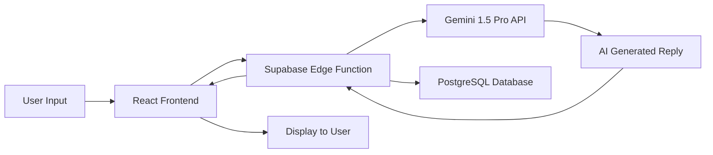

# 🤖 AI Email Reply Assistant

> An intelligent email assistant that generates professional, context-aware responses using AI. Select your tone, paste your email, and get a perfectly crafted reply in seconds.


---

## ✨ Features

- **🎯 Tone Selection**: Choose from Professional, Friendly, or Concise tones
- **🤖 AI-Powered**: Leverages Google's Gemini 1.5 Pro for intelligent response generation
- **⚡ Fast & Responsive**: Built with Vite for lightning-fast development and builds
- **💾 Reply History**: Stores generated replies in PostgreSQL for future reference
- **🎨 Modern UI**: Beautiful interface built with Tailwind CSS and shadcn/ui components
- **🔒 Secure**: Environment-based API key management and secure data handling
- **📝 Editable Drafts**: Review and edit AI-generated responses before sending

---

## 🛠️ Tech Stack

### Frontend
- **React 18** with TypeScript
- **Vite** - Next-generation build tool
- **Tailwind CSS** - Utility-first styling
- **shadcn/ui** - High-quality React components

### Backend
- **Supabase Edge Functions** - Serverless TypeScript functions
- **PostgreSQL** - Relational database (via Supabase)
- **Deno Runtime** - Secure TypeScript runtime for edge functions

### AI/ML
- **Google Gemini 1.5 Pro** - Advanced language model with 1M token context window
- **Prompt Engineering** - Optimized prompts for context-aware email generation

### Dev Tools
- **Bun/npm** - Package management
- **ESLint** - Code linting
- **TypeScript** - Type safety

---

## 🚀 Quick Start

### Prerequisites
- Node.js 18+ or Bun
- Supabase account
- Google AI Studio API key (Gemini)

### 1. Clone the Repository
```bash
git clone https://github.com/arindamdandapat11/AI-email-assistant.git
cd AI-email-assistant
```

### 2. Install Dependencies
```bash
# Using npm
npm install

# Or using Bun (faster)
bun install
```

### 3. Environment Setup

Create a `.env` file in the root directory:

```env
VITE_SUPABASE_URL=https://your-project-id.supabase.co
VITE_SUPABASE_ANON_KEY=your-anon-public-key
```

### 4. Configure Supabase

```bash
# Login to Supabase
cd supabase
supabase login

# Link to your project
supabase link --project-ref YOUR_SUPABASE_PROJECT_ID
```

### 5. Set Gemini API Key

```bash
# Set secrets in Supabase
supabase secrets set \
  GEMINI_API_KEY="YOUR_GEMINI_KEY_HERE" \
  GEMINI_MODEL="gemini-1.5-pro"
```

Get your Gemini API key from: https://ai.google.dev/

### 6. Deploy Edge Function

```bash
# Deploy the backend function
supabase functions deploy generate-reply
```

Your function will be available at:
```
https://YOUR_PROJECT_ID.supabase.co/functions/v1/generate-reply
```

### 7. Setup Database (Optional)

For reply history storage, run the SQL migration:

```bash
# From Supabase Dashboard → SQL Editor
# Or via CLI:
supabase db push
```

This creates the `email_replies` table:
```sql
CREATE TABLE email_replies (
  id SERIAL PRIMARY KEY,
  sender TEXT,
  subject TEXT,
  body TEXT,
  tone TEXT,
  generated_reply TEXT,
  created_at TIMESTAMPTZ DEFAULT NOW()
);
```

### 8. Run the Application

```bash
# Development server
npm run dev
# or
bun run dev
```

Open http://localhost:8080 in your browser.

---

## 📁 Project Structure

```
AI-email-assistant/
├── src/
│   ├── components/          # React components
│   ├── lib/                 # Utility functions
│   ├── App.tsx              # Main application component
│   └── main.tsx             # Entry point
├── supabase/
│   ├── functions/
│   │   └── generate-reply/  # Edge function for AI
│   │       └── index.ts
│   └── sql/
│       └── init.sql         # Database schema
├── public/                  # Static assets
├── .env                     # Environment variables
├── package.json             # Dependencies
├── vite.config.ts           # Vite configuration
├── tailwind.config.ts       # Tailwind configuration
└── tsconfig.json            # TypeScript configuration
```

---

## 🎯 How It Works



1. User pastes an email and selects desired tone
2. React frontend sends request to Supabase Edge Function
3. Edge Function constructs optimized prompt for Gemini AI
4. Gemini processes the email and generates contextual reply
5. Response is stored in PostgreSQL (optional)
6. AI-generated reply is displayed to user
7. User can edit before copying/sending

---

## 🔧 Configuration

### Tone Options

The assistant supports three tone modes:

- **Professional**: Formal, business-appropriate language
- **Friendly**: Warm, conversational tone
- **Concise**: Brief, to-the-point responses

### Customizing Prompts

Edit `supabase/functions/generate-reply/index.ts` to customize AI behavior:

```typescript
const prompt = `You are an expert email assistant.
Tone: ${tone}
Original Email: ${emailContent}

Generate a ${tone} reply that...`;
```

---

## 🚢 Deployment

### Frontend Deployment

Deploy to Vercel (recommended):
```bash
npm run build
vercel --prod
```

Or Netlify:
```bash
npm run build
netlify deploy --prod
```

### Backend

Supabase Edge Functions are automatically deployed when you run:
```bash
supabase functions deploy generate-reply
```

---

## 🔐 Security

- ✅ API keys stored as Supabase secrets (never in frontend)
- ✅ Environment variables for sensitive data
- ✅ CORS configured for production domains
- ✅ Input validation on all API endpoints
- ✅ Rate limiting via Supabase (coming soon)

---

## 📊 Performance

- ⚡ Sub-second UI response times with Vite HMR
- 🚀 Gemini 1.5 Pro average response time: 2-4 seconds
- 💾 PostgreSQL queries optimized with indexing
- 📦 Production bundle size: ~150KB (gzipped)

---

## 🛣️ Roadmap

- [ ] Multi-language support
- [ ] Email thread context analysis
- [ ] Template library for common responses
- [ ] Browser extension
- [ ] Mobile app (React Native)
- [ ] Integration with Gmail/Outlook APIs
- [ ] Advanced analytics dashboard

---

## 🤝 Contributing

Contributions are welcome! Please feel free to submit a Pull Request.

1. Fork the repository
2. Create your feature branch (`git checkout -b feature/AmazingFeature`)
3. Commit your changes (`git commit -m 'Add some AmazingFeature'`)
4. Push to the branch (`git push origin feature/AmazingFeature`)
5. Open a Pull Request

---

## 📝 License

This project is licensed under the MIT License - see the [LICENSE](LICENSE) file for details.

---

## 👨‍💻 Author

**Arindam Dandapat**

- GitHub: [@arindamdandapat11](https://github.com/arindamdandapat11)
- Email: arindamdandapat11@gmail.com
- LinkedIn: [https://www.linkedin.com/in/arindam-dandapat]

---

## 🙏 Acknowledgments

- [Google Gemini AI](https://ai.google.dev/) for the powerful language model
- [Supabase](https://supabase.com/) for the excellent backend platform
- [shadcn/ui](https://ui.shadcn.com/) for beautiful React components
- [Tailwind CSS](https://tailwindcss.com/) for the styling framework

---

## 📞 Support

If you find this project helpful, please ⭐ star the repository!

For issues and questions, please open an issue on GitHub.

---

**Made with ❤️ by Arindam Dandapat**
